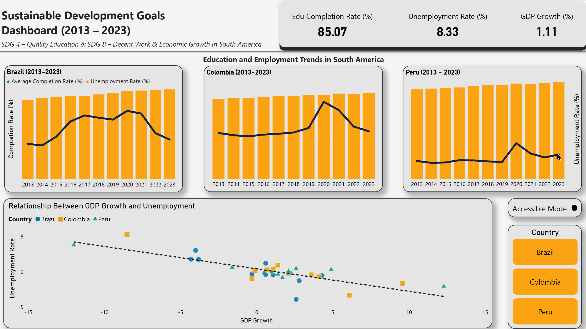

# Sustainable Development Goals Dashboard (Power BI)

Interactive data analytics dashboard analysing progress towards key United Nations Sustainable Development Goals (SDGs) in South America between **2013 and 2023**.

This project focuses on:

- **SDG 4 — Quality Education**
- **SDG 8 — Decent Work & Economic Growth**

The dashboard explores how education outcomes, unemployment, and economic growth interact across Brazil, Colombia, and Peru.

This project demonstrates practical business intelligence development, data modelling, and accessible dashboard design for real-world policy analysis.

---

## Project Overview

This Power BI dashboard was developed to support data-driven insights into social and economic development trends across South America.

It enables users to:

- Track education completion rates over time  
- Monitor unemployment trends across countries  
- Analyse GDP growth patterns  
- Explore relationships between economic growth and labour markets  
- Compare countries interactively  
- View data in both standard and accessibility-optimised visual modes  

The dashboard is fully interactive and designed for clear analytical storytelling.

---

## Key Analytical Features

### Country Comparison
Interactive filtering allows comparison of Brazil, Colombia, and Peru across all indicators.

### Time-Series Analysis
Visualises longitudinal trends from 2013 to 2023 for:

- Education completion rates  
- Unemployment rates  
- Economic growth  

### Economic Relationship Modelling
Scatter plot analysis explores the relationship between:

- GDP growth  
- Unemployment rate  

Includes regression trend line to highlight macroeconomic patterns.

### Accessibility Mode
The dashboard includes an alternative visual theme using a **colour-blind safe palette (Okabe–Ito)** to ensure accessibility and inclusive data communication.

---

## Dashboard Preview

### Normal Mode


### Accessibility Mode (Colour-blind Friendly)


---

## Data Source

The dashboard uses publicly available macroeconomic and social development indicators aligned with United Nations Sustainable Development Goal reporting.

Indicators include:

- Education completion rates  
- Unemployment rates  
- GDP growth  
- Country-level time series data (2013–2023)  

Data was cleaned, structured, and modelled for analytical use within Power BI.

---

## Tools & Technologies

- Power BI Desktop  
- Data modelling and transformation  
- DAX measures  
- Custom Power BI themes  
- Accessible data visualisation design  
- Time-series and comparative analytics  

---

## Project Structure

```
sdg-dashboard-powerbi/
│
├── dashboard/
│   └── sdg_dashboard.pbix              # Main Power BI dashboard
│
├── theme/
│   └── okabe-ito-theme.json            # Colour-blind safe theme
│
├── exports/
│   ├── screenshots/
│   │   ├── sdg_dashboard_normal_mode.png
│   │   └── sdg_dashboard_accessible_mode.png
│   │
│   └── sdg_dashboard.pdf               # Static export of dashboard
│
├── README.md
└── LICENSE
```

---

## How to Use

1. Download the `.pbix` file from the `dashboard/` folder  
2. Open using Power BI Desktop (latest version recommended)
3. Interact with filters and visuals to explore the data  

No additional setup required.

---

## Analytical Objectives

This project demonstrates practical data analytics skills including:

- Dashboard design and layout optimisation  
- Interactive reporting  
- Data storytelling  
- Comparative country analysis  
- Accessibility-aware visualisation  
- Translating real-world policy metrics into analytical insights  

---

## Portfolio Context

This dashboard is part of a professional data analytics portfolio showcasing:

- Business intelligence development  
- Public policy data analysis  
- Visual communication of complex datasets  
- Accessible dashboard design principles
  
---

## Key Insight

The analysis highlights how education outcomes and labour market performance interact with economic growth, demonstrating measurable relationships between human capital development and macroeconomic stability across South American economies.

---

## Author

**Kieran Rossetti**  
Data Analytics & Business Intelligence Portfolio Project
